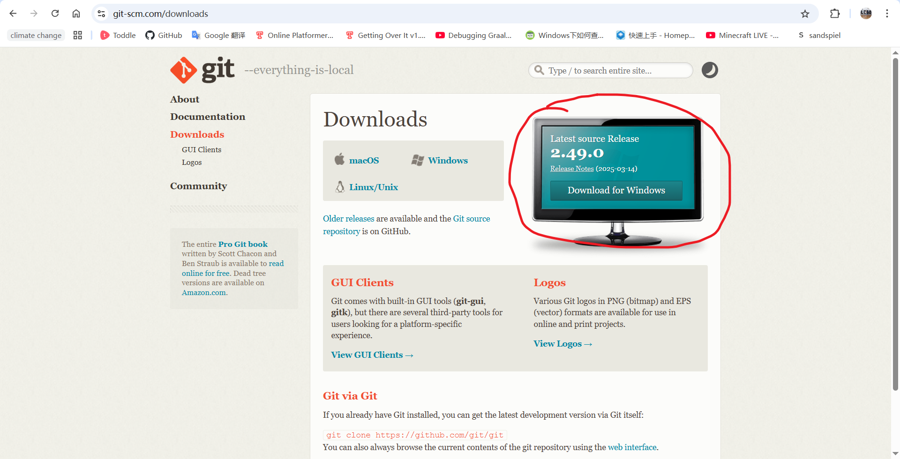

# ScanSSH

## Table of contents
- [Introduction](#introduction)
- [How to...](#how-to)
  - [How to install](#how-to-install-)
  - [How to build](#how-to-build-)
    - [check environment](#check-environment)
    - [clone repository and build](#clone-repository-and-build)
  - [How to use](#how-to-use-)
  - [How to contribute](#how-to-contribute-)
- [Bye](#bye)


## Introduction
ScanSSH is a tool for [OpenSSH](https://github.com/openssh/openssh-portable). It's made by Python and it has **two** branches(version): [**Full version**](FULL.md) and [**Streamline version**](STREAMLINE.md).

Full version has **SSH Server Scanner for a network segment, SSH Server Scanner for one IP, SSH Server Scanner for all of the devive of LAN, Add device ip to ips group, Remove device ip from ips group, List device from ips group, Connect with IP, Connect with device in ips group**, and more for you to explore

Streamline version only supports **SSH Server Scanner for one IP, Connect device with one IP**. So we recommend you to use Full version. But if you don't like *Every time when I run this program. First, choose what option will I choose. Second, again inputing option for connecting ... I'm dead* You can just choose Streamline version!


## How to...
Here shows some questions what the developer of ScanSSH noticed, and we will answer these questions. Also, you can take question in the [issue page](https://github.com/lucheshidi/ScanSSH/issues).

### How to install ?
You can go to [the download page](https://github.com/lucheshidi/ScanSSH/releases) to choose your Operating System and System Architecture. If there's no matching choise for you, you can first [take an issue](https://github.com/lucheshidi/ScanSSH/issues) and see [here](#how-to-build).

Here shows the version history of ScanSSH
[ history ]

### How to build ?
If you didn't find your Operating System or System Architecture in the download page and this part is for you. Here is how to do it:

#### check environment
First, open your system terminal, it's may like this:
```terminal
/ $ 
```
or this:
```terminal
/> 
```
or this:
```terminal
user@mac:/ % 
```

And you can input:
```bash
python --version
```
if it returns like this
```output
Python 3.10.0

```
And you are already installed Python Environment, you can jump to [here](#clone-repository-and-build)

First, you can go to [Python Website](python.org) via a web browser.
And then, click on the `Downloads` button.

Then, you should see a page like this:

So click on the yellow `Download Python 3.xx.x` and wait for the web browser download Python.

When it's done, you can install python just like you are installing other applications using the file you just downloaded.

If you successfully installed Python, youcan input in terminal:
```bash
python --version
```
If it's shows `Python ` and the same number when you clicked on the yellow download, you are successfully installed python!


#### clone repository and build
First, open [Git website](https://git-scm.com/downloads) via a web browser.
And you will see this:

So click on the button says `Download for xxx` and choose your architecture to download and wait for web browser to download.

If its done, inout this in your terminal:
```bash
git --version
```
If it shows `git 2.xx.x.xxx.1`, and you can go next, if it shows command not found like an error, you should redo **clone repository and build**.

So input this in terminal:
```bash
git clone https://github.com/lucheshidi/ScanSSH.git # clone the repository of the codes
cd ScanSSH # go into the copied repository folder
pip install pyinstaller
```
Now, you've installed the full environment to build the program. Now you need to input in terminal:
```bash
pyinstaller main.py
pyinstaller streamline.py
```
So now, you go into `dist` folder and there will be two folders named `main` and `streamline`

If you want to use Streamline version, just copy `streamline` or `streamline.exe` in the `streamline` folder away to where you like!
Also, If you want to use Full version just copy `main` or `main.exe` in `main` folder away!


### How to use ?
***WARNING:*** **This example is just showing in Windows 10, If you are using another system so the procedure will be some differences**

In my system I just open the `main.exe` or `streamline.exe` I've just built or downloaded from download page, and it will be a black commandline window, and you can follow the instruction on the window to use it


### How to contribute ?
You <u>***NEED***</u> a Pycharm Professional or a Pycharm Community or a Visual Studio Code to code with [**V**irtual **Env**ironment](https://docs.python.org/3/library/venv.html).

We recommend you to use Visual Studio Code.

And you clone the repository like [building ScanSSH](#how-to-build-) and open the project directory in your Pycharm or VSCode.

Now you get the code of ScanSSH, you can edit it in a great way. If you think your edit could be work, you can type in terminal:
```bash
git add ./*  # adding changed files to repository.
git commit -am <Message for update>  # commit your changes.
git push origin test  # push your changes to test branch and we will see is it really available.
```
the end says like:
```output
To https://github.com/lucheshidi/ScanSSH.git
   ac87c50..46c7783  test -> test
```
You are successfully created your edit, and you can wait, we need some holidays to try and apply your change.


## Bye! 